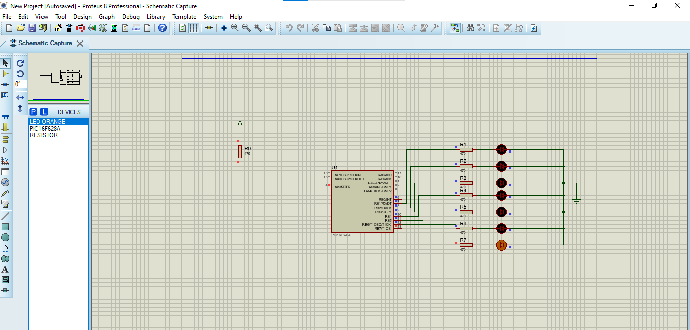

Implement a Knight Rider LED chaser effect using loops and delays on PIC16F628A.
Objectives:

Configure PORTB pins as outputs.

Use loops to shift LED lighting left and right.

Apply delay functions for smooth animation.

my-project/
  README.md
  images/
    LED_Chaser.png

